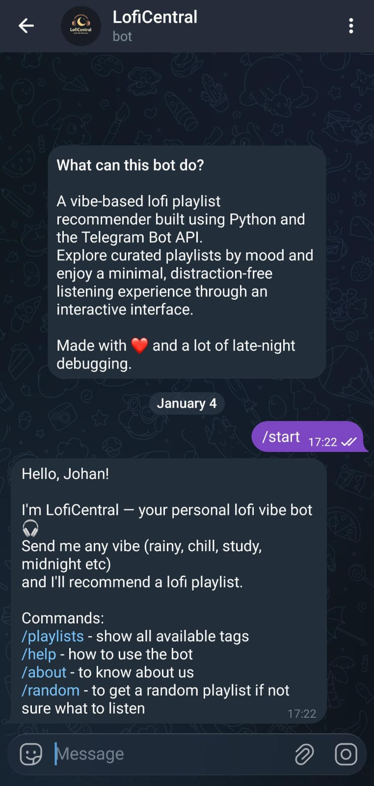
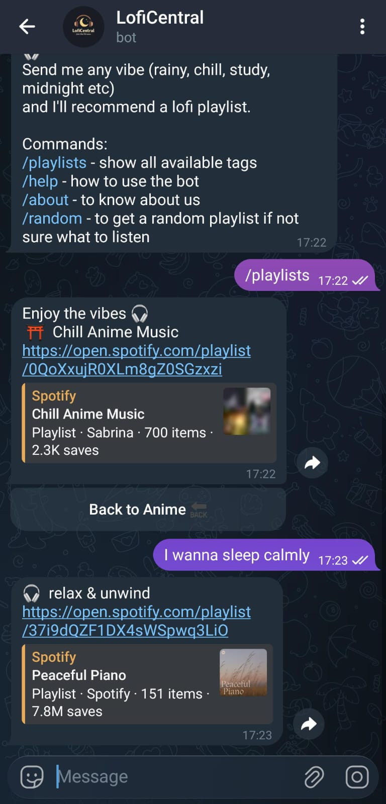

# 🎧 LofiCentral

**LofiCentral** is a Telegram bot that recommends curated lofi playlists based on user-selected vibes and moods.  
It is built with a clean, scalable, **webhook-based architecture** and is designed for calm listening, late-night focus, and future AI-powered recommendations.

---

## ✨ Features

- 🎶 Vibe-based lofi playlist recommendations  
- 🧭 Clean multi-screen UI using inline keyboards  
- 🎲 Random playlist discovery  
- 🔁 Smooth back navigation (no message spam)  
- ⚡ Fast responses using webhook-based delivery  
- 🧠 Architecture ready for future NLP / LLM integration  

---

## 📸 Screenshots

> _(Glimpse of the `LofiCentral` interface.)_

### Start & Vibe Selection


### Playlist Recommendations


### Playlist Details


---

## 🖥 Screens & Flow

### Screen 1 — Vibe Selection
- Genres / moods displayed with emojis  
- 2 buttons per row for clean UX  

### Screen 2 — Playlist Recommendations
- Randomly selected playlists per vibe  
- 3 playlists shown at a time  

### Screen 3 — Playlist Details
- Playlist title + direct link  
- Back navigation supported  

---

## 🛠 Tech Stack

- **Language:** Python 3.11  
- **Bot Framework:** `python-telegram-bot >= 20.7` (async)  
- **Web Framework:** FastAPI  
- **Server:** Uvicorn  
- **Deployment:** Render (Webhook-based)  
- **Data Storage:** JSON (`playlists.json`)  

---

## 🧱 Architecture Overview

- **Webhook-based architecture (no polling)**
- **Separation of concerns**
  - `bot.py` → Telegram Application & handler registration  
  - `webhook_app.py` → FastAPI server & webhook endpoint  
  - `handlers/` → Commands and callback handlers  
  - `screens.py` → UI rendering logic  
  - `data/playlists.json` → Static playlist data  

---

## 🔁 Callback Data Contract
- `<type>:<value>`
- **Examples:**
  - `v:rain` → vibe selection
  - `p:3` → playlist index
  - `b:root` → back navigation

This contract is strictly followed for all navigation logic.

---

## 🚀 Deployment

- Hosted on **Render**
- Python version pinned using `.python-version`
- Telegram webhook configured once (no polling, no ngrok in production)
- Designed for **24/7 availability**

---

## 🔐 Environment Variables

```env
BOT_TOKEN=your_telegram_bot_token
```
⚠️ Secrets are not committed to the repository and are managed via Render.

---
## 🎯 Design Principles

- Webhook-first architecture (no polling)
- Clean, screen-based navigation
- Minimal message spam
- Explicit async handling
- Modular and readable code
- Scalability kept in mind from day one

---
## 🔮 Future Scope

- Smarter playlist recommendations
- Natural language vibe detection
- User preference learning
- Playlist APIs instead of static JSON
- Usage analytics
- Personalised daily vibe suggestions

---
## 🤝 Contributing

This is currently a solo project.

The codebase is structured to be contributor-friendly, and ideas, issues, and pull requests are welcome.

---
## 👤 Author

Built by **Utkarsh**  
If you're interested in lofi, backend systems, or Telegram bots — feel free to connect.

---

## 🏷 Version

**v1.0.0**

- Core playlist recommendation flow implemented
- Webhook-based production deployment
- Stable multi-screen UI
- Ready for real users

Future versions will focus on intelligence, personalization, and scale.

---

## 🏁 Status

✅ Live and deployed  
🚧 Actively evolving

